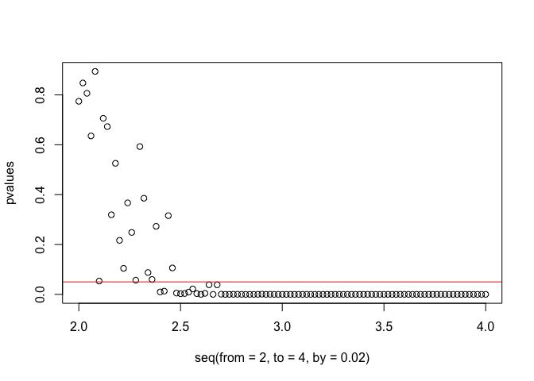
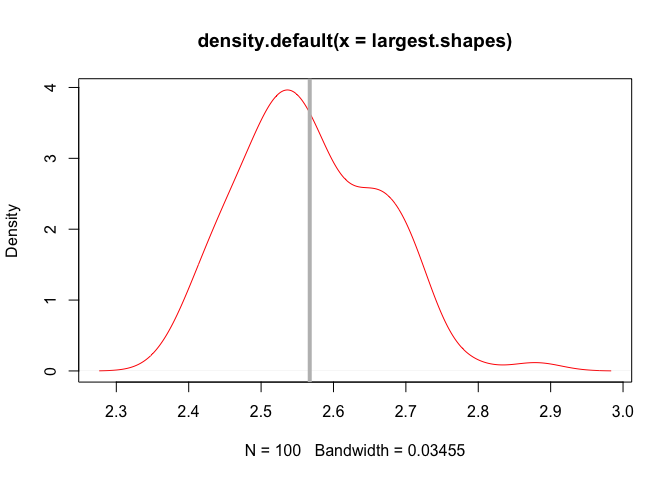

Basic Hypothesis Testing
================
Yue Shi, PhD candidate, University of Washington,
4/21/2018

Import packages and data sets
-----------------------------

We will import ww\_data file and pac\_data file as a comparator, and two libraries, ggplot2 (for plotting) and BSDA (basic statistics and data analysis).

``` r
library(ggplot2)
library(BSDA)
ww_data = read.table(file="http://faculty.washington.edu/dfowler/teaching/2017/GNOM560/560_ww_data.txt", header = T, sep = '\t')
pab_data = read.table(file="http://faculty.washington.edu/dfowler/teaching/2017/GNOM560/560_pab_data.txt", header = T, sep = '\t') 
```

Parametric testing: Compare two means
-------------------------------------

#### One-sample T test

Compare sample mean to a value. For example, does sample mean deviate from *α*.

``` r
t.test(ww_data$scaled_effect, mu=0) 
```

    ## 
    ##  One Sample t-test
    ## 
    ## data:  ww_data$scaled_effect
    ## t = 57.11, df = 376, p-value < 2.2e-16
    ## alternative hypothesis: true mean is not equal to 0
    ## 95 percent confidence interval:
    ##  0.8019972 0.8591921
    ## sample estimates:
    ## mean of x 
    ## 0.8305947

``` r
t.test(ww_data$scaled_effect, mu = 0, alternative = "two.sided") ## By default, R will do two-side t test.
```

    ## 
    ##  One Sample t-test
    ## 
    ## data:  ww_data$scaled_effect
    ## t = 57.11, df = 376, p-value < 2.2e-16
    ## alternative hypothesis: true mean is not equal to 0
    ## 95 percent confidence interval:
    ##  0.8019972 0.8591921
    ## sample estimates:
    ## mean of x 
    ## 0.8305947

``` r
t.test(ww_data$scaled_effect, mu = 0, alternative = "less")
```

    ## 
    ##  One Sample t-test
    ## 
    ## data:  ww_data$scaled_effect
    ## t = 57.11, df = 376, p-value = 1
    ## alternative hypothesis: true mean is less than 0
    ## 95 percent confidence interval:
    ##       -Inf 0.8545763
    ## sample estimates:
    ## mean of x 
    ## 0.8305947

``` r
t.test(ww_data$scaled_effect, mu = 0, alternative = "greater")
```

    ## 
    ##  One Sample t-test
    ## 
    ## data:  ww_data$scaled_effect
    ## t = 57.11, df = 376, p-value < 2.2e-16
    ## alternative hypothesis: true mean is greater than 0
    ## 95 percent confidence interval:
    ##  0.8066131       Inf
    ## sample estimates:
    ## mean of x 
    ## 0.8305947

#### Two-sample T test

##### First, check the assumption of normality. But remember, t test is robust to non-normality.

**Make a histogram** to check the data distribution.

``` r
ggplot(ww_data, aes(scaled_effect))+
  geom_histogram(fill="blue",alpha=0.25)
```


``` r
ggplot(pab_data, aes(scaled_effect))+
  geom_histogram(fill="red",alpha=0.25)
```


**Make a QQ plot**. A Q-Q plot is a graphical method for comparing two probability distributions by plotting their quantiles against each other. If the distributions are identical, the points will lie on a line with a slope of 1If they have the same shape but are related by a linear transformation, the Q-Q plot will be linear but with a slope other than 1. Q-Q plots allow you to spot outliers. QQ plot has the following format qqplot(distribution1, distribution2)

``` r
qqplot(dnorm(seq(min(ww_data$scaled_effect), max(ww_data$scaled_effect), 0.01),
             mean(ww_data$scaled_effect), sd(ww_data$scaled_effect)), ww_data$scaled_effect)
```


``` r
qqplot(dnorm(seq(min(pab_data$scaled_effect), max(pab_data$scaled_effect), 0.01),
            mean(pab_data$scaled_effect), sd(pab_data$scaled_effect)), pab_data$scaled_effect)
```


Compare probability distributions between ww\_data and pab\_data.

``` r
qqplot(ww_data$scaled_effect, pab_data$scaled_effect)
```


**The Kolmogorov-Smirnov test** is a nonparametric test that can be used to compare a sample distribution ot a reference distribution or to compare two sample distributions. Try to use the Kolmogorov-Smirnov test (ks.test()) to check for normality. As we'll learn, the KS test compares a set of data to a cumulative distribution function. Here, you will want to use "pnorm" (the normal cumulative distribution function).

``` r
ks.test(ww_data$scaled_effect, "pnorm", mean(ww_data$scaled_effect), sd(ww_data$scaled_effect))
```

    ## 
    ##  One-sample Kolmogorov-Smirnov test
    ## 
    ## data:  ww_data$scaled_effect
    ## D = 0.13099, p-value = 4.812e-06
    ## alternative hypothesis: two-sided

``` r
ks.test(pab_data$scaled_effect, "pnorm", mean(pab_data$scaled_effect), sd(pab_data$scaled_effect))
```

    ## 
    ##  One-sample Kolmogorov-Smirnov test
    ## 
    ## data:  pab_data$scaled_effect
    ## D = 0.2313, p-value < 2.2e-16
    ## alternative hypothesis: two-sided

##### Second, check the assumption for homogeneity of variance.

**Bartlett's test** can be used to determine if samples are drawn from populations with the same variance. Try to use Bartlett's test (bartlett.test()) test to see if the variances can be pooled.

``` r
bartlett.test(list(ww_data$scaled_effect, pab_data$scaled_effect))
```

    ## 
    ##  Bartlett test of homogeneity of variances
    ## 
    ## data:  list(ww_data$scaled_effect, pab_data$scaled_effect)
    ## Bartlett's K-squared = 1.9762, df = 1, p-value = 0.1598

##### Third, do a two-sample 2-sides t test.

``` r
t.test(ww_data$scaled_effect, pab_data$scaled_effect, paired=FALSE,var.equal=TRUE)
```

    ## 
    ##  Two Sample t-test
    ## 
    ## data:  ww_data$scaled_effect and pab_data$scaled_effect
    ## t = 1.898, df = 1651, p-value = 0.05788
    ## alternative hypothesis: true difference in means is not equal to 0
    ## 95 percent confidence interval:
    ##  -0.001004963  0.061135480
    ## sample estimates:
    ## mean of x mean of y 
    ## 0.8305947 0.8005294

``` r
ggplot(ww_data, aes(scaled_effect)) + geom_density(fill = "blue", alpha = 0.25) + geom_density(data = pab_data, aes(scaled_effect), fill = "red", alpha = 0.25)
```


Non-parametric hypothesis testing
---------------------------------

``` r
x=rnorm(100,2) #Generate some data
```

#### Sign Test

Background: For example, when the data is not normally distributed, rather than apply a transformation, you can use sign test. It simply allocates a sign (+ or -) to each observation. It tests the equality of matched pairs of observations. The null hypotheis is that the median of the differences is zero. No further assumptions are made. **It is used in situations in which the one-sample or paired t-test might traditionally be applied**. As a rule, nonparametric methods, particularly when used in small samples, have rather less power than their parametric equivalents.

Let's test to see if this data really does come from a distribution with a median of 2

``` r
SIGN.test(x, md = 2) # it use median (md) instead of mean (mu). 
```

    ## 
    ##  One-sample Sign-Test
    ## 
    ## data:  x
    ## s = 47, p-value = 0.6173
    ## alternative hypothesis: true median is not equal to 2
    ## 95 percent confidence interval:
    ##  1.652047 2.239145
    ## sample estimates:
    ## median of x 
    ##    1.938595 
    ## 
    ## Achieved and Interpolated Confidence Intervals: 
    ## 
    ##                   Conf.Level L.E.pt U.E.pt
    ## Lower Achieved CI     0.9431  1.653 2.2354
    ## Interpolated CI       0.9500  1.652 2.2391
    ## Upper Achieved CI     0.9648  1.650 2.2471

What about using one-sample t-test on this?

``` r
t.test(x,mu=2)
```

    ## 
    ##  One Sample t-test
    ## 
    ## data:  x
    ## t = -0.098859, df = 99, p-value = 0.9214
    ## alternative hypothesis: true mean is not equal to 2
    ## 95 percent confidence interval:
    ##  1.792890 2.187451
    ## sample estimates:
    ## mean of x 
    ##  1.990171

#### Wilconxon Signed-Rank Test

Background: Though the sign test is extremely simple to perform, one obvious disadvantage is that it does not take the maginitude of the observation into account and may reduce the statistical power of the test. The alternative that accounts for the magnitude of the observations is the Wilcoxon signed rank test. It tests the equality of matched pairs of observations. It assumes the distribution is symmetrical. The null hypothesis is that both distributions are the same.

``` r
wilcox.test(x, mu = 2) #it use mean (mu) instead of median (md)
```

    ## 
    ##  Wilcoxon signed rank test with continuity correction
    ## 
    ## data:  x
    ## V = 2503, p-value = 0.9411
    ## alternative hypothesis: true location is not equal to 2

Now, you try with paired data. First, generate some random data from the normal distribution, calculate the difference and do the appropriate test.

``` r
y=rnorm(100,2.5)
dif=x-y
t.test(dif,mu=0)
```

    ## 
    ##  One Sample t-test
    ## 
    ## data:  dif
    ## t = -3.9579, df = 99, p-value = 0.0001424
    ## alternative hypothesis: true mean is not equal to 0
    ## 95 percent confidence interval:
    ##  -0.8851404 -0.2939999
    ## sample estimates:
    ##  mean of x 
    ## -0.5895702

``` r
SIGN.test(dif,md=0)
```

    ## 
    ##  One-sample Sign-Test
    ## 
    ## data:  dif
    ## s = 38, p-value = 0.02098
    ## alternative hypothesis: true median is not equal to 0
    ## 95 percent confidence interval:
    ##  -1.0317611 -0.2551181
    ## sample estimates:
    ## median of x 
    ##  -0.5836762 
    ## 
    ## Achieved and Interpolated Confidence Intervals: 
    ## 
    ##                   Conf.Level  L.E.pt  U.E.pt
    ## Lower Achieved CI     0.9431 -1.0173 -0.3039
    ## Interpolated CI       0.9500 -1.0318 -0.2551
    ## Upper Achieved CI     0.9648 -1.0628 -0.1504

``` r
wilcox.test(dif,mu=0)
```

    ## 
    ##  Wilcoxon signed rank test with continuity correction
    ## 
    ## data:  dif
    ## V = 1478, p-value = 0.0003204
    ## alternative hypothesis: true location is not equal to 0

**Wilcoxon signed-rank test is more powerful than the simply sign test.** Using the rank data in addition to the sign data gave us much better precision, since it has smaller p value.

#### Wilcoxon Rank Sum Test (a.k.a Mann-Whitney test or Wilcoxon-Mann-Whitney test)

Background: the sign test and Wilcoxon signed rank test are useful non-parametric alternatives to the one-sample and paired t-tests. **A nonparametric alternative to the unpaired t-test is given by the Wilcoxon rank sum test, which is also known as the Mann-Whitney test.** When used in one-sample or paired test, wilcox.test means Wilcoxon signed rank test, whereas when used in unpaired two-sample test, *wilcox.test* means Wilcoxon rank sum test.

``` r
z=rnorm(100,2)
wilcox.test(x,z) 
```

    ## 
    ##  Wilcoxon rank sum test with continuity correction
    ## 
    ## data:  x and z
    ## W = 5035, p-value = 0.9328
    ## alternative hypothesis: true location shift is not equal to 0

Now make random normal data set of 1000 elements with a mean of 2 and a random gamma data set whose shape parameter is 2 (will also have an expected value of 2). Make density plot of each, marking the means.

``` r
normd=rnorm(1000, mean=2)
mean_norm=mean(normd)
gammad=rgamma(1000, shape=2)
median_gamma=median(gammad)
normd=as.data.frame(normd)
gammad=as.data.frame(gammad)
library(ggplot2)
ggplot(normd, aes(normd)) + 
  geom_density(fill = "blue", alpha = 0.25) + 
  geom_vline(xintercept=mean_norm, col="blue")+
  geom_density(data = gammad, aes(gammad), fill = "red", alpha = 0.25) +
  geom_vline(xintercept=median_gamma, col="red")
```


What do you think will happen when you do a Wilcoxon rank sum test with these data? Give it a try and see. Remember, wilcoxon test assumes symmetric disetribution, whereas gamma distribution is not necessarily symmetrical.

``` r
wilcox.test(normd$normd,gammad$gammad)
```

    ## 
    ##  Wilcoxon rank sum test with continuity correction
    ## 
    ## data:  normd$normd and gammad$gammad
    ## W = 547020, p-value = 0.0002717
    ## alternative hypothesis: true location shift is not equal to 0

Next, do a WRST on the WW domain reported\_effect scores vs the Pab1 reported\_effect scores, and compare the results with t test.

``` r
wilcox.test(ww_data$reported_effect,pab_data$reported_effect)
```

    ## 
    ##  Wilcoxon rank sum test with continuity correction
    ## 
    ## data:  ww_data$reported_effect and pab_data$reported_effect
    ## W = 271280, p-value = 0.0001586
    ## alternative hypothesis: true location shift is not equal to 0

``` r
t.test(ww_data$reported_effect,pab_data$reported_effect)
```

    ## 
    ##  Welch Two Sample t-test
    ## 
    ## data:  ww_data$reported_effect and pab_data$reported_effect
    ## t = 4.3899, df = 701.15, p-value = 1.309e-05
    ## alternative hypothesis: true difference in means is not equal to 0
    ## 95 percent confidence interval:
    ##  0.2076716 0.5437370
    ## sample estimates:
    ##  mean of x  mean of y 
    ## -0.8239443 -1.1996486

``` r
ggplot(ww_data, aes(reported_effect)) + 
  geom_density(fill = "blue", alpha = 0.25) + 
  geom_density(data = pab_data, aes(reported_effect), fill = "red", alpha = 0.25)
```


Since both datasets on reported effect are not normally distributed, use a non-parametrid test such as wilcoxon rank sum test is a good idea.

#### Kruskal-Wallis Test

Background: Wilcoxon rank sum test is for comparing two independent groups, **kruskal-wallis test is an non-parametric alternative of anova for comparing three independent groups.**

Create three random gamma-distributed data set with 100 elements and an identical shape parameter of your choice. Use kruskal.test() to verify that the medians are the same

``` r
d1=rgamma(100,shape=2)
d2=rgamma(100,shape=2)
d3=rgamma(100,shape=2)
kruskal.test(list(d1,d2,d3))
```

    ## 
    ##  Kruskal-Wallis rank sum test
    ## 
    ## data:  list(d1, d2, d3)
    ## Kruskal-Wallis chi-squared = 0.35547, df = 2, p-value = 0.8372

OK, now double the shape parameter for d3 and test again

``` r
d3=rgamma(100,shape=4)
kruskal.test(list(d1,d2,d3))
```

    ## 
    ##  Kruskal-Wallis rank sum test
    ## 
    ## data:  list(d1, d2, d3)
    ## Kruskal-Wallis chi-squared = 77.811, df = 2, p-value < 2.2e-16

Use **pairwise.wilcox.test()** to see which of our three data sets is different from the others (note the automatic correction for multiple hypothesis testing). It requires some formatting work.

``` r
combined.vector=c(d1,d2,d3)
grouping.vector=c(rep("d1",length(d1)),rep("d2",length(d2)),rep("d3",length(d3)))
pairwise.wilcox.test(combined.vector,grouping.vector, paired = TRUE)
```

    ## 
    ##  Pairwise comparisons using Wilcoxon signed rank test 
    ## 
    ## data:  combined.vector and grouping.vector 
    ## 
    ##    d1      d2     
    ## d2 0.56    -      
    ## d3 1.4e-11 1.4e-12
    ## 
    ## P value adjustment method: holm

To get a sense of the power of the KW test, try varying the shape parameter in increments of 1% up or down and find the threshold for detectiong the difference.

``` r
shape.param=seq(2,4,0.02)
random.gamma=sapply(shape.param,function(x){rgamma(100,x)}, simplify=FALSE)
pvalues=sapply(random.gamma, function(x){kruskal.test(list(d1,d2,x))$p.value})
par(mfrow=c(1,1))
plot(seq(from=2, to=4, by=0.02), pvalues)
abline(h=0.05,col="red")
```



Repeast this exercise 100 times.

``` r
random.gamma = function(x) {
shape.param = seq(2, 4, 0.02)
random.gammas = sapply(shape.param, function(x) {rgamma(100, x)}, simplify = FALSE)
pvalues = sapply(random.gammas, function(x) {kruskal.test(list(d1, d2, x))$p.value})
largest.shape = max(which(pvalues > 0.05))
return(2 + 0.02*largest.shape)
}

largest.shapes = sapply(1:100, random.gamma)

plot(density(largest.shapes), col = "red")
abline(v = mean(largest.shapes), col = "gray", lwd = 4)
```



Conclusion: the KW test will not tell the difference up to shape=2.45, which is pretty bad.
